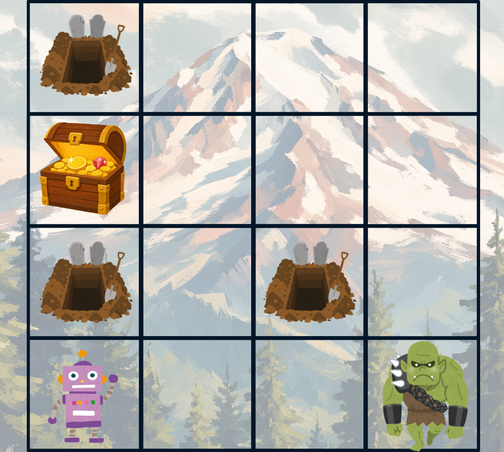
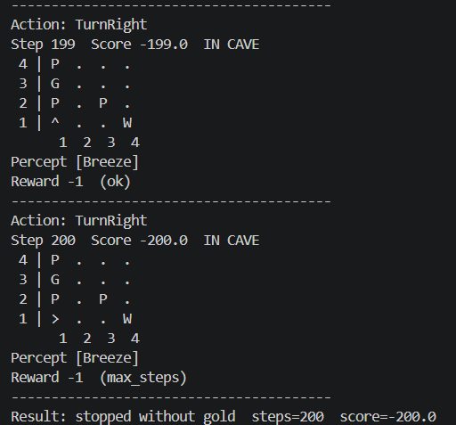
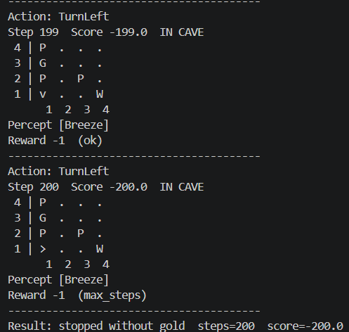
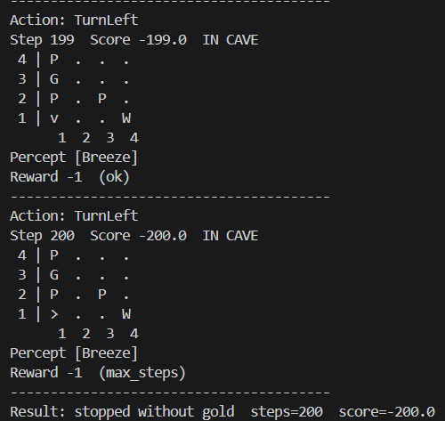
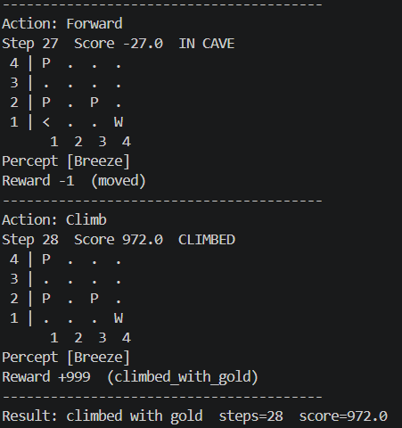

## Entrega

1. El archivo `mi_cueva_4x4.yaml`.
2. Un diagrama (dibujo o ASCII) de tu cueva, indicando agente, Wumpus, pits y oro.
3. Un breve reporte (media página) que responda:
   - ¿Qué agentes lograron salir con el oro en tu mapa y cuáles no?
   - ¿Por qué el **agente de reflejo simple** falla (o tiene suerte) en tu diseño?
   - ¿Cómo cambia el resultado del **agente basado en modelo** si acercas o alejas
     un pit de la casilla inicial?
4. Evidencias (captura de pantalla) de haber corrido los 4 agentes con tus nueva configuración del mundo.

***

### El archivo

[Click aquí para el codigo de mi cueva](mi_cueva_4x4.yaml)

### Diagrama de mi cueva

### Reporte 

Después de poner a prueba los cuatro modelos con mi nueva configuración, únicamente el Utility-based agent logró salir de la cueva con el oro mientras que todos los demás terminaron cayendo en un pit o siendo comidos por el wumpus. De hecho, la configuración de la cueva que terminé por utlizar es la cuerta versión, porque aunque intenté siempre dejar un camino seguro bastante claro, me era dificil lograr que un agente saliera de la cueva con el oro.
En el caso particular del agente de reflejo simple, creo que termina con un muy mal performance (muere a los pocos pasos) porque mi configuración empieza con un pit cerca de la entrada, lo que limita los movimientos del agente a una única opción que lo termina acercando al Wumpus. También como no tiene memoria de las casillas anteriores, al tratar de alejarse del Wumpus nada más termina por acercarse a otro de los pits que puse en su camino. 

Me di cuenta de que (casi) independientemente del modelo, mientras más se alejan los pits de una casilla inicial, los modelos terminan por tener un mejor performance (ya sea que sí logran salir con el oro, o mínimo se adentran más a la cueva).

### Evidencias 
| Simple reflex | Model based |
| :---: | :---: |
|  |  |
| Goal based| Utility based |
|  |  |