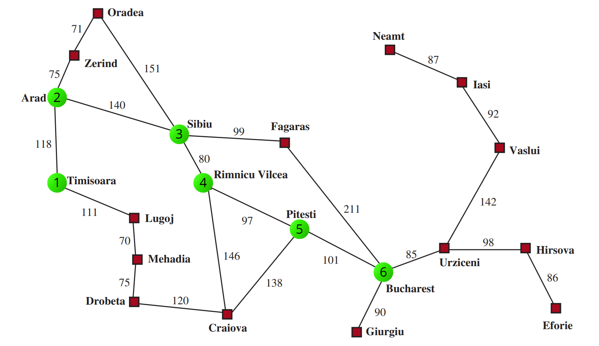

## Objetivo

Elegir una ruta distinta de Arad → Bucharest, inspeccionar `h(n)`, correr
Greedy y A*, y analizar diferencias de camino, costo, profundidad y nodos
expandidos a la luz de `g`, `h` y `f`.

***

## Entrega

Para este proyecto, decidí utilizar como punto de partida la ciudad de `Timisoara` en dirección hacia `Bucharest` (que fue uno de los caminos recomendados en el repositorio). He aquí el resultado que tuvo cada uno de los algoritmos: 

| Greedy best first search | A* search |
| :---: | :---: |
|  |  |

Adjunto igualmente el comparativo de las métricas obtenidas en cada uno de los algoritmos

# Greedy best-first search
| City | g | h | f |
| :--- | ---: | ---: | ---: |
| Timisoara | 0 | 329 | 329 |
| Lugoj | 111 | 244 | 355 |
| Mehadia | 181 | 241 | 422 |
| Drobeta | 256 | 242 | 498 |
| Craiova | 376 | 160 | 536 |
| Pitesti | 514 | 100 | 614 |
| Bucharest | 615 | 0 | 615 |

| Heuristic | straight-line distance to Bucharest |
| :--- | :--- |
| Status | Success |
| Path | Timisoara → Lugoj → Mehadia → Drobeta → Craiova → Pitesti → Bucharest |
| Depth | 6 roads |
| Cost | 615 km |
***
### A* search
| City | g | h | f |
| :--- | ---: | ---: | ---: |
| Timisoara | 0 | 329 | 329 |
| Arad | 118 | 366 | 484 |
| Sibiu | 258 | 253 | 511 |
| Rimnicu Vilce | 338 | 193 | 531 |
| Pitesti | 435 | 100 | 535 |
| Bucharest | 536 | 0 | 536 |

| Heuristic | straight-line distance to Bucharest |
| :--- | :--- |
| Status | Success |
| Path | Timisoara → Arad → Sibiu → Rimnicu Vilcea → Pitesti → Bucharest |
| Depth | 5 roads |
| Cost | 536 km |
***

Después de ejecutar todos los algoritmos y analizar los resultados, podemos observar de manera clara cómo A* encontró el camino que terminó "costando" menos kilómetros, mientras que Greedy eligió otro camino basándose en la heurística "menos cara". Esto se debe a la naturaleza del algoritmo que siempre termina eligiendo el camino que parezca más fácil basándose en su heurística sin necesariamente estar al tanto del costo de los pasos siguientes.

Para responder la última pregunta del ejercicio, es bueno recordar que intrínsecamente para A*: `f(n)` = `h(n)` + `g(n)`. Donde podríamos pensar en _h_ como el costo estimado faltante y _g_ el costo en el que ya incurrimos. Si lo pensamos de esa manera, podemos darnos cuenta de la relación inversa de entre esos dos. Mientras más tiempo haya manejado, menos distancia falta por recorrer.

***
[Click aquí](Evidencias) para ver evidencias de haber corrido los algoritmos.