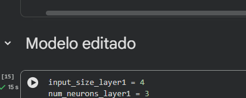
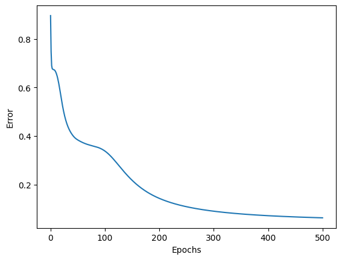
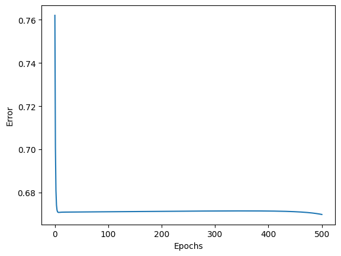
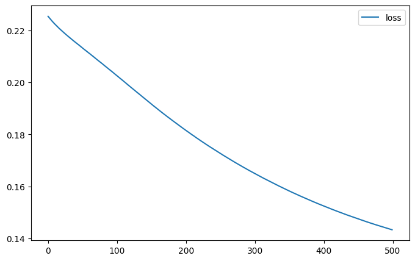
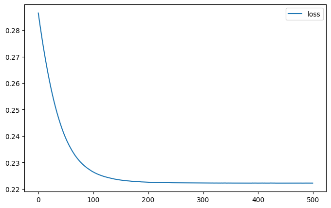

## Objetivo

Correr ambas notebooks en **Google Colab** con la arquitectura original,
**agregar dos capas** a cada red, volver a entrenar y **comparar** qué cambia
(curva de error/pérdida, velocidad, calidad de la clasificación).

***
***

A continuación, [adjunto](Notebooks) la carpeta en donde se podrán encontrar las notebook en donde edité los modelos originales para poder agregarle dos capas a cada red. Para diferenciar, agregé un markdown debajo del modelo original para poder mostrar dónde empieza la edición del modelo que hice. Se ve de la siguiente manera:

### Gráficas del loss 
| Multileyer perceptron (original) | Multileyer perceptron (editado) |
| :---: | :---: |
|  |  |
| Keras MLP (original)|  Keras MLP (editado) |
|  |  |

