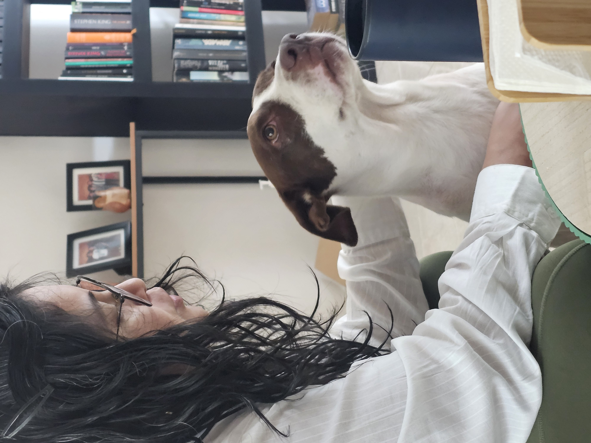
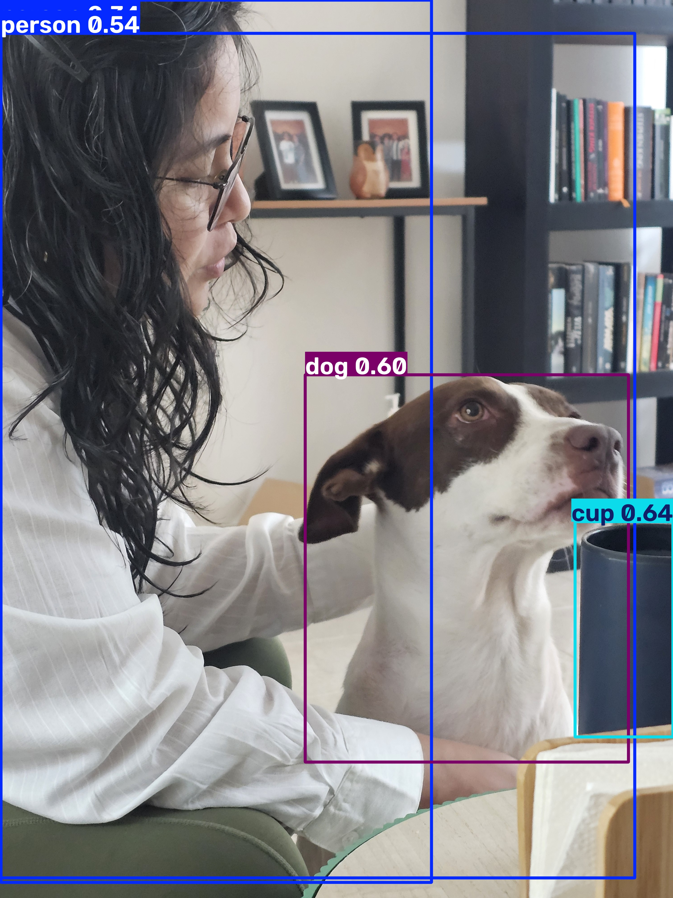

## Objetivo

Correr la notebook en Colab **tal como está**, sustituir las dos imágenes de
muestra por **una imagen tuya** (la misma en ambas predicciones) y comparar
qué objetos detecta YOLO en la foto original frente a la tuya.

***
***

[Clic aquí](Notebooks/YOLO_editada.ipynb) para poder ver la notebook sobre la cual corrí el modelo junto con mi imagen clasificada.

Adjunto las imágenes originales así como sus cajas de respuesta: 

| Zidane | Zidane clasificada |
| :---: | :---: |
|  |  |
| Bus | Bus clasificada |
|  |  |
| Imagen propia | Imagen propia clasificada |
|  |  |

En la [foto de Zidane](Imagenes/zidane.jpg), YOLO detectó correctamente dos personas y una corbata.
En la [foto del bus](Imagenes/bus.jpg), YOLO detectó correctamente a 4 personas, 1 autóbus y 1 señal de alto.
En [mi foto](Imagenes/mi_foto.jpg), YOLO detectó correctamente a una persona, a mi perro y un vaso. Sin embargo, tenía mucha curiosidad al utilizar esta foto porque había clases disponibles en YOLO que en mi imagen eran de un tamaño muy pequeño, y efectivamente no fueron detectadas, como por ejemplo los libros del librero y las personas que salen en los marcos de las fotos. 
***
***
[Clic aquí](Evidencias) para ver las evidencias de haber corrido el modelo en mi instancia de Colab.