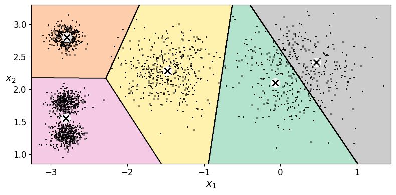
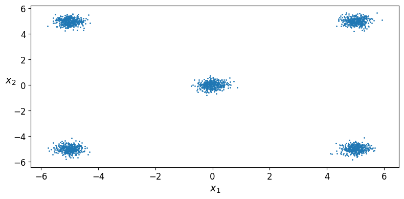
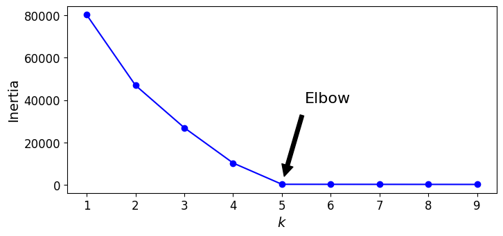
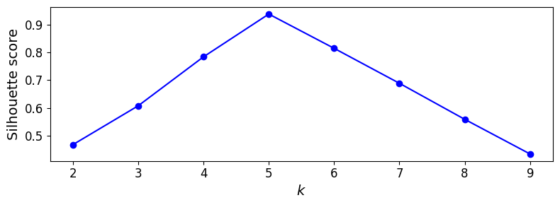

## Objetivo

Correr la notebook en Colab **tal como está**, anotar el \(k\) que sugieren
codo y silueta, **separar los 5 blobs** en el arreglo `blob_centers` (y, si
hace falta, `blob_std`) y volver a graficar. Debes ver si el codo y la
silueta se mueven hacia **\(k = 5\)**.

***
***

## Resultados originales con la notebook sin editar
A continuación, adjunto las gráficas resultantes de correr la notebook original:

|  |  |
| :---: | :---: |
| *Figura 1: Scatter plot con los blobs originales* | *Figura 2: Diagrama de Voronoi (con K=5)* |
|  |  |
| *Figura 3: Curva de inercia* | *Figura 4: Curva de silueta* |
***

Después de haber corrido la notebook con los parámetros originales, hice modificaciones tanto en los centroides como en la desviación estandar de cada uno de ellos para que los "grupos" sean visual y matemáticamente mucho más fáciles de poder separar. Para ser más preciso, estos son los centroides que utilicé: 
[-5.0,  5.0],
[ 5.0,  5.0],
[ 0.0,  0.0],
[-5.0, -5.0],
[ 5.0, -5.0]

Cada uno con una desviación de 0.25. 
Para mayor información en la modificación del código, [adjunto la notebook modificada sobre la cual trabajé](Notebook/01_K_medias.ipynb).

Igualmente, adjunto las comparativas de mis resultados contra los originales:

| Scatter original | Scatter modificada |
| :---: | :---: |
|  |  |
| Diagrama de Voronoi original | Diagrama de Voronoi modificado |
|  |  |
| Curva de inercia original| Curva de inercia modificada |
|  |  |
| Curva de silueta original| Curva de Silueta modificada |
|  |  |

***
***

Para responder la pregunta de *En los datos de Géron, ¿por qué el codo “prefiere” (k = 4) si make_blobs usó 5 centros*, nos tenemos que fijar muy bien que los centroides utilizados son muy similares y de hecho comparten el vlaor de -2.8 como valor sobre X y su diferencia de "altura" igualmente es considerablemente pequeña entre sí. Por eso mismo, al momento de crear los blobs terminan estando muy agrupados entre sí y termina básicamente agrupando dos de los tres grupos creando asi "4" únicos grupos. Esto igualmente se puede corroborar con el codo y la silueta que se sitúan en K=4.

Al momento de crear mis datos, forcé mucha separación entre los centroides y utilicé una desviación pequeña, precisamente como se ve en la imagen, para poder hacer visual y matemáticamente la distinción entre cada grupo. Por esto mismo, tanto mi codo como la silueta coinciden en mi k=5.

Además de la notebook previamente adjuntada, [se puede consultar una captura](imagenes/evidencia.png) como evidencia de mi instanciai en Colab para corroborar que corrí y modifiqué el código.