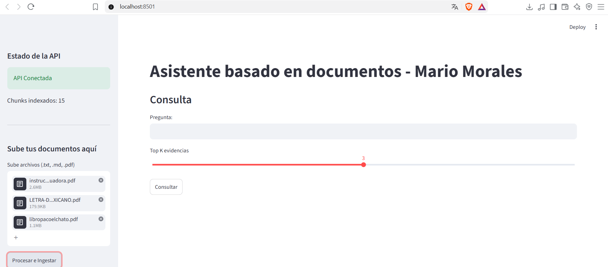

# Reporte sobre el proyecto final

El archivo ejecutable principal para poder utilizar y probar este proyecto [se encuentra aquí](main.py), junto con las [instrucciones de uso](README.md). Obviamente, por razones de seguridad, mis credenciales no están incluidas en el proyecto, por lo que es necesario que, de manera local, se escriban las credenciales personales.

Originalmente utilicé tres corpus de ejemplo; sin embargo, uno de ellos era un PDF del cuento de Paco el Chato, cuyo contenido consistía únicamente en imágenes del libro, por lo que no sirvió para este proyecto, pues, tal cual, "no era un PDF con texto". Los documentos que terminé utilizando, ambos en PDF, son [el himno nacional](documentos_de_ejemplo/LETRA-DE-HIMNO-NACIONAL-MEXICANO.pdf) y el [instructivo de una licuadora](documentos_de_ejemplo/instructivo_licuadora.pdf) que encontré en internet.

***
***

Terminé utilizando una interfaz muy básica de Streamlit, que se ve de la siguiente manera: 

A continuación, muestro los resultados de dos preguntas, una específicamente para cada uno de los documentos que utilicé:

***Himno nacional***

***Licuadora***

Igualmente, hice una pregunta que estaba totalmente fuera del alcance de los documentos que procesé, para tener control de qué contestaría mi RAG.

***Pregunta fuera del scope***

***
***
Para el dominio de mi proyecto, como se menciona al principio del reporte, fueron tres documentos PDF, pero, dado que uno de ellos tenía únicamente imágenes y nada de texto, terminé por utilizar solamente dos: un manual de una línea de licuadoras Oster y el Himno Nacional Mexicano.
Con respecto al modelo, elegí *gemini-embedding-2*. Realmente no existe un motivo específico para el uso de ese modelo; honestamente, nunca había utilizado las API de Gemini, por lo que desconocía las opciones disponibles y terminé utilizando el que me ofrecía más tokens por menor precio.
Se utilizó también un tamaño de 300 palabras con un overlap de 50. Llegué a este número luego de analizar el contenido de los PDF que utilicé, ya que terminé por determinar que era un número ideal para tener una idea general de lo que se estaba analizando, y los 50 de overlap me garantizaban tener continuidad conceptual. Como experimento personal, luego me gustaría utilizar un PDF con ideas cortas (como un libro de haikus o poesía) y uno donde las ideas sean necesariamente largas. Supongo que ese tamaño de chunk de 300 palabras no tendría el mismo rendimiento que tuvo en este proyecto.
La decisión de abstenerse de dar una respuesta la recargué totalmente en el modelo que utilicé, pues directamente en [el prompt](back/generate.py) que le pasé al modelo (línea 23), utilicé un conjunto de reglas a seguir y explícitamente escribí que, al momento de no encontrar suficiente evidencia, devolviera una negación total.